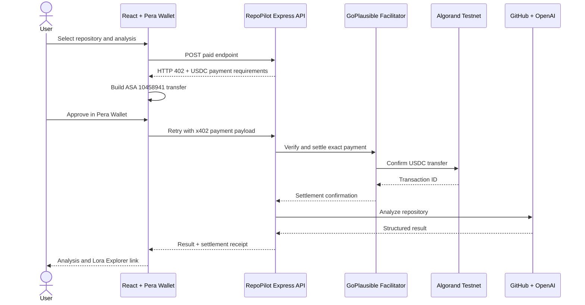

# RepoPilot AI

Production-oriented, pay-per-request intelligence for GitHub repositories. RepoPilot combines a responsive React client, an Express analysis API, OpenAI-powered reports, and verifiable x402 payments on Algorand.

## Stable x402 Pricing: ALGO to USDC

> **RepoPilot no longer prices or settles analysis requests in native ALGO. All service payments settle in Testnet USDC, Algorand Standard Asset (ASA) `10458941`, through the x402 protocol.**

**Why?**
Native ALGO volatility made a fixed API price unpredictable between quote and settlement. Testnet USDC gives users and machine clients stable USD-denominated micro-pricing. Each feature is quoted from `$0.01` to `$0.04` USDC, independent of ALGO market movements.

The payer needs a small Testnet ALGO balance to cover the Algorand network fee, typically about `0.001 ALGO`. The service charge itself is transferred and settled exclusively in USDC.

| Payment concern | Asset |
| --- | --- |
| RepoPilot analysis settlement | Testnet USDC (ASA `10458941`) |
| Algorand network transaction fee | A minimal Testnet ALGO balance |
| Payment verification and settlement | GoPlausible x402 facilitator |

## x402 Payment Flow



The frontend uses `@x402-avm/fetch` to handle the HTTP `402 Payment Required` challenge and `@x402-avm/avm` to sign an exact Algorand asset transfer through Pera Wallet. The backend uses `@x402-avm/express`, `@x402-avm/core`, and `ExactAvmScheme` to advertise, verify, and settle protected routes. Confirmed transaction IDs are stored as receipts and link to [Algorand Lora Explorer](https://lora.algokit.io/testnet).

## Analysis Modules

| Endpoint | Feature | Price |
| --- | --- | ---: |
| `POST /api/pitch-deck` | Investor-ready pitch deck outline | `$0.02` USDC |
| `POST /api/security-audit` | Security risks and recommended fixes | `$0.03` USDC |
| `POST /api/architecture` | Architecture insights and diagrams | `$0.02` USDC |
| `POST /api/investor-score` | Investment readiness score | `$0.01` USDC |
| `POST /api/readme-rewrite` | Professional repository documentation | `$0.01` USDC |
| `POST /api/dependency-audit` | Dependency, license, and risk review | `$0.02` USDC |
| `POST /api/market-analysis` | Market and competitor analysis | `$0.04` USDC |
| `POST /api/demo-script` | Structured product demo script | `$0.01` USDC |

The complete suite costs `$0.16` Testnet USDC. Users pay only for the requested module.

## Product Architecture

```text
frontend/
  React 19 UI
  Pera Wallet connection and safety controls
  x402-aware fetch client and receipt extraction
  Responsive analyzer, history view, and result modal
        |
        | HTTP 402 challenge / paid retry
        v
backend/
  Express 4 API and rate limiting
  x402 route middleware and GoPlausible facilitator client
  GitHub repository ingestion and OpenAI analysis services
  SQLite settlement receipt history
        |
        v
Algorand Testnet
  USDC ASA 10458941 settlement + Lora transaction record
```

### Wallet State and Safety

`frontend/src/App.jsx` keeps connection state non-destructive. The wallet popover shows the full address and a network label driven by `REACT_APP_ALGORAND_NETWORK`. Disconnect is a separate command with an explicit confirmation step, and connection or disconnection failures surface in the UI.

### Dynamic Results

`frontend/src/components/ResultModal.jsx` normalizes unrealistic hour-based backend estimates into short minute tasks and calculates the total improvement time from individual plan items. Settlement receipts expose the transaction ID, active network, USDC asset, facilitator status, and a Lora Explorer link. The modal is viewport-bounded and vertically scrollable on small screens.

### Responsive Interface

The frontend supports mobile, tablet, and desktop viewports. Below `768px`, header controls, analysis cards, statistics, inputs, and actions become full-width vertical layouts. Tablet layouts use two analysis columns, while desktop uses the available multi-column grid. Wide transaction data scrolls within its own accessible container instead of overflowing the page.

## Tech Stack

| Layer | Technology |
| --- | --- |
| Frontend | React 19, Create React App, responsive CSS |
| Wallet | Pera Wallet Connect |
| x402 client | `@x402-avm/fetch`, `@x402-avm/avm`, `@x402-avm/core` |
| API | Node.js, Express, Helmet, CORS, rate limiting |
| x402 server | `@x402-avm/express`, `ExactAvmScheme`, GoPlausible facilitator |
| Blockchain | Algorand Testnet, USDC ASA `10458941`, AlgoNode |
| Intelligence | GitHub API, OpenAI API |
| Persistence | SQLite settlement receipts |
| Operations | Docker, Docker Compose, npm |

## Local Setup

### Prerequisites

- Node.js 18 or newer
- npm
- Pera Wallet with Testnet USDC ASA `10458941` opted in
- A small Testnet ALGO balance for network fees
- OpenAI API key and GitHub token
- Merchant Testnet account opted into the same USDC asset

### Install

```bash
git clone https://github.com/mustapha-bashiru/repopilot-ai.git
cd repopilot-ai
npm --prefix backend install
npm --prefix frontend install
```

Create local environment files. On macOS/Linux:

```bash
cp backend/.env.example backend/.env
cp frontend/.env.example frontend/.env
```

On Windows PowerShell:

```powershell
Copy-Item backend/.env.example backend/.env
Copy-Item frontend/.env.example frontend/.env
```

### Environment

Frontend, `frontend/.env`:

```env
REACT_APP_API_URL=http://localhost:3001
REACT_APP_ALGOD_URL=https://testnet-api.algonode.cloud
REACT_APP_ALGORAND_NETWORK=testnet
```

`REACT_APP_API_URL` selects the backend endpoint. `REACT_APP_ALGORAND_NETWORK` accepts `testnet`, `mainnet`, or `preview` and controls the wallet UI's active-network label. The current x402 settlement engine and receipt links intentionally remain fixed to Algorand Testnet, so a working demonstration must use `testnet`.

Backend, `backend/.env`:

```env
ALGOD_SERVER=https://testnet-api.algonode.cloud
ALGOD_PORT=443
ALGOD_TOKEN=
MERCHANT_ADDRESS=your_58_character_algorand_testnet_address

X402_FACILITATOR_URL=https://facilitator.goplausible.xyz

AI_PROVIDER=openai
OPENAI_API_KEY=your_openai_api_key
GITHUB_TOKEN=your_github_token

DATABASE_URL=./data/repopilot.db
PORT=3001
NODE_ENV=development
FRONTEND_URL=http://localhost:3000
```

Never commit `.env` files, private keys, wallet recovery phrases, or provider credentials. The merchant address is public; its signing key does not belong in this application.

### Run

Start the API:

```bash
npm --prefix backend run dev
```

Start the frontend in a second terminal:

```bash
npm --prefix frontend start
```

Open `http://localhost:3000`. The API listens on `http://localhost:3001` by default.

### Production Build

```bash
npm --prefix frontend run build
docker compose build
```

## Verify the x402 Integration

1. Fund a Pera Testnet account with Testnet USDC ASA `10458941` and enough Testnet ALGO for fees.
2. Configure an opted-in `MERCHANT_ADDRESS` and the GoPlausible facilitator URL.
3. Start both services, connect Pera Wallet, and submit a paid analysis.
4. Approve the USDC transfer presented by Pera Wallet.
5. Open the transaction ID shown in the result receipt or transaction history.
6. Confirm the asset transfer on [Lora Testnet Explorer](https://lora.algokit.io/testnet) and verify the recipient and USDC amount.

A plain `curl` request to a paid endpoint is still useful for checking the challenge boundary:

```bash
curl -i -X POST http://localhost:3001/api/pitch-deck \
  -H "Content-Type: application/json" \
  -d '{"repo":"https://github.com/facebook/react"}'
```

Without an x402 payment payload, the expected response is HTTP `402` with requirements for the exact scheme, Algorand Testnet, USDC ASA `10458941`, and the configured merchant address.

## Security and Operational Controls

- Paid analysis handlers execute only after x402 verification and settlement.
- The server initializes facilitator capabilities before reporting the API as ready.
- Confirmed settlements are persisted idempotently in SQLite for receipt history.
- Provider tokens stay server-side and are loaded from environment variables.
- Helmet, CORS allowlisting, JSON size limits, and API rate limiting protect the Express surface.
- The wallet signs only user-approved transactions; RepoPilot never receives wallet private keys.

Additional detail is available in [`docs/x402-flow.md`](docs/x402-flow.md) and [`docs/api-reference.md`](docs/api-reference.md).

## License

MIT